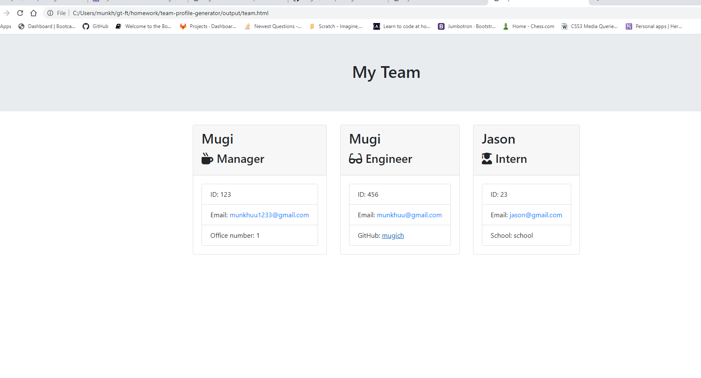
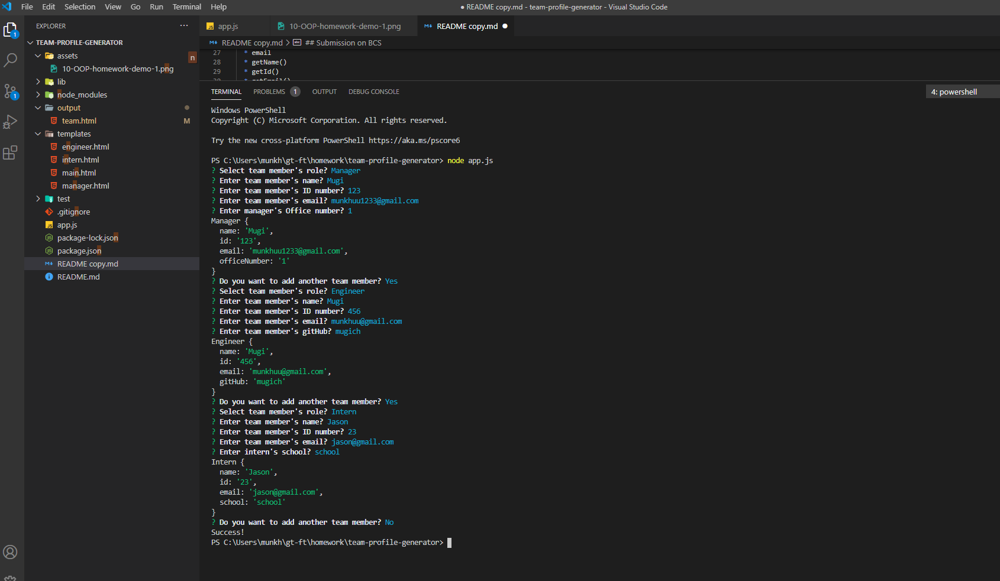

# Project Description "team-profile-generator" 

This team generator command line application run in node. The application will prompt the user for information about the team manager and then information about the team members. The user can input any number of team members, and they may be a mix of engineers and interns. This application passed all unit tests and  will create an HTML file that displays a nicely formatted team roster based on the information provided by the user. 

The dependencies are, [jest](https://jestjs.io/) for running the provided tests, and [inquirer](https://www.npmjs.com/package/inquirer) for collecting input from the user.
 HTML templates for each type of user.

  * `main.html`

  * `engineer.html`
  
  * `intern.html`
  
  * `manager.html`

### Classes
The application has the these classes: `Employee`, `Manager`, `Engineer`,
`Intern`. The tests for these classes in the `tests` directory  all passed.
The first class is an `Employee` parent class with the following properties and
methods:

  * name
  * id
  * email
  * getName()
  * getId()
  * getEmail()
  * getRole() // Returns 'Employee'

The other three classes will extend `Employee`. 
In addition to `Employee`'s properties and methods, `Manager` will also have:

  * officeNumber

  * getRole() // Overridden to return 'Manager'

In addition to `Employee`'s properties and methods, `Engineer` will also have:

  * github  // GitHub username

  * getGithub()

  * getRole() // Overridden to return 'Engineer'

In addition to `Employee`'s properties and methods, `Intern` will also have:

  * school 

  * getSchool()

  * getRole() // Overridden to return 'Intern'

### Application link

* [GitHub repositories](https://github.com/mugich/team-profile-generator)

### Application's appearance

